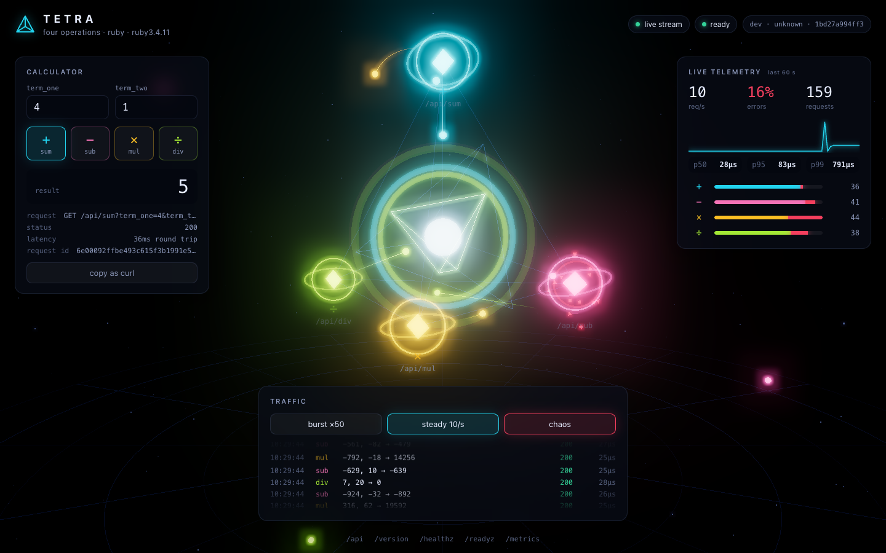

# Tetra · Ruby

[](https://github.com/giovannirco/tetra-ruby/actions/workflows/ci.yml)

A four-operation arithmetic API, built the way I'd ship a production service: tests with coverage, structured logs, Prometheus metrics with SLO alerts, health probes, graceful shutdown, a hardened container, and a three.js UI that draws every request as it happens.

This is the Ruby implementation: Sinatra 4 on an embedded Puma, with RSpec and SimpleCov. It is one of four implementations of the same [contract](docs/CONTRACT.md): [Go](https://github.com/giovannirco/tetra-go), **Ruby** (this repo), [Node.js](https://github.com/giovannirco/tetra-node) and [TypeScript](https://github.com/giovannirco/tetra-ts). A shared contract test proves the four behave the same.



In the UI each operation sits on a vertex of a tetrahedron around the service core. Every API request, from any client, arrives over Server-Sent Events and becomes a particle: it flies to its operation and into the core, or shatters at the node if it was rejected. The panels show the calculator, the live rate, error ratio and server-side latency percentiles, and a traffic generator with a chaos mode that mixes in invalid requests.

## Quick start

Needs Docker; no local Ruby required.

```sh
make up        # app, Prometheus and Grafana; open http://localhost:8000
make smoke     # 27-check contract test against the running app
make down
```

| URL | What |
|---|---|
| http://localhost:8000 | UI |
| http://localhost:8000/api/sub?term_one=4&term_two=1 | `{"result":3}` |
| http://localhost:9090/alerts | Prometheus with the SLO alert rules loaded |
| http://localhost:3000 | Grafana, Tetra dashboard as home, no login |

Ports clash with something else? `APP_PORT=8080 GRAFANA_PORT=3300 make up`.

With Ruby 3.3+ installed: `bundle install && make run`.

## API

| Request | Response |
|---|---|
| `GET /api/sum?term_one=4&term_two=1` | `200 {"result":5}` |
| `GET /api/sub?term_one=4&term_two=1` | `200 {"result":3}` |
| `GET /api/mul?term_one=4&term_two=1` | `200 {"result":4}` |
| `GET /api/div?term_one=7&term_two=2` | `200 {"result":3}` |
| `GET /api/div?term_one=1&term_two=0` | `400 {"error":"division by zero"}` |
| `GET /api/sum?term_one=abc&term_two=1` | `400 {"error":"term_one must be an integer, got \"abc\""}` |

Decisions where a spec like this is silent:

- **Integers only, 64-bit.** The result is specified as an integer, so terms are integers too; `1.5` is rejected rather than rounded. Ruby integers never overflow, so every term and result is checked against the int64 range explicitly: a result outside it is a `400`, the same as in the other implementations.
- **Division truncates toward zero** (`7/2 = 3`, `-7/2 = -3`). Ruby's `Integer#/` floors (`-7 / 2 == -4`), so `Calc` divides exactly with `Rational` and truncates. The spec suite pins all four sign combinations.
- **Errors are `400` with a JSON body**, and say what was wrong.

Also served on port 8000: `/healthz` (liveness), `/readyz` (readiness, turns `503` while draining), `/metrics`, `/version`, `/api` (the operation catalogue) and `/events` (the live stream). The full list is in [docs/CONTRACT.md](docs/CONTRACT.md).

## Changing the API

Operations live in one list in [`lib/tetra/calc.rb`](lib/tetra/calc.rb). Adding one, say modulo, takes two steps:

1. Add an entry:
   ```ruby
   Operation.new(name: 'mod', symbol: '%', label: 'Modulo', apply: lambda { |a, b|
     raise Error.new('division by zero', 'division_by_zero') if b.zero?

     a.remainder(b) # sign of the dividend, like Go's and JavaScript's %
   }),
   ```
2. Add its cases to `spec/calc_spec.rb`.

The route `GET /api/mod`, the catalogue at `/api`, the metrics labels and the UI (a new node in the scene, a new button) all pick it up. Then `make up` rebuilds and redeploys the container; the UI header shows the new commit.

## Tests

```sh
make test     # RSpec in a ruby:3.4 container; SimpleCov fails under 90% of lines
make lint     # RuboCop
```

Coverage is **99.2%** of lines and 91% of branches (67 examples). The specs cover the calculator edge cases (overflow in every operation, `MIN / -1`, truncation in every sign combination), every HTTP status the API returns, a malformed query string, readiness during drain, the live stream (fan-out, heartbeat, a dead peer, a full buffer, a partial write, the stream limit, shutdown), metric and log output, and the process lifecycle on a real Puma: start, serve, stream over a hijacked socket, stop, drain. `scripts/smoke.sh` is the black-box contract test, run in CI against the built container.

## How it is built

```
bin/tetra                 entry: starts the server, traps SIGTERM/SIGINT
lib/tetra/server.rb       embedded Puma, timeouts, the shutdown sequence
lib/tetra/calc.rb         the four operations (int64-checked, truncating division)
lib/tetra/app.rb          Sinatra routes: /api, probes, metrics, version, UI, 404/405, errors
lib/tetra/telemetry.rb    Prometheus metrics and the request log middleware
lib/tetra/live.rb         Server-Sent Events broker for /events
lib/tetra/middleware.rb   request IDs, security headers, the /events endpoint
lib/tetra.rb              wiring (Rack::Builder)
web/                      the UI (plain ES modules, three.js vendored, no build step)
observability/            Prometheus config, alert rules, Grafana dashboard
```

- **Sinatra, configured for an API.** `rack-protection` is off in favor of explicit security headers. Host authorization allows any `Host`, since the service is reached by cluster DNS, IPs and port-forwards. Exceptions never reach the client: Sinatra errors that carry a 4xx keep their status, and anything else becomes a JSON 500 that is logged.
- **Live streams without a thread each.** `/events` uses a Rack response hijack: Puma writes the headers and hands over the socket, and the broker writes frames with `write_nonblock`. A full buffer drops that event (counted); a partial write disconnects the subscriber, because a half frame would corrupt the stream (the browser reconnects).
- **Puma is embedded, not launched.** The launcher's own SIGTERM handling would close the listener at once. `Tetra::Server` instead fails readiness, keeps serving for `DRAIN_DELAY_SECONDS`, ends the live streams, then stops Puma gracefully, which forces shutdown after `SHUTDOWN_TIMEOUT_SECONDS`.
- **The API doesn't know about the extras.** Each calculation is reported through an `on_event` callback; metrics and the live stream subscribe to it.
- **Observability.** RED metrics per route with a bounded `route` label, calculation outcomes per operation, in-flight requests, build info, resident memory and process start time. One difference from the other three: a hijacked stream leaves Puma's request cycle at once, so `tetra_http_requests_in_flight` does not count open live streams; `tetra_live_subscribers` does. One JSON log line per request, carrying the request ID. The alert rules encode two SLOs: 99.9% availability (5xx only) and p99 under 50 ms.
- **Container.** Native gems compile in a build stage; the runtime is `ruby:3.4-alpine` with no compiler, running as an unprivileged user. Compose runs it read-only with every capability dropped.
- **UI.** three.js is vendored (`make vendor-three`), so the page needs no CDN and the Content-Security-Policy allows only same-origin scripts. Values from the network are written as text, never as HTML.

## Configuration

| Variable | Default | |
|---|---|---|
| `PORT` | `8000` | listen port |
| `LOG_LEVEL` | `info` | `debug` also logs probes and scrapes |
| `DRAIN_DELAY_SECONDS` | `5` | readiness-off period before the listener closes |
| `SHUTDOWN_TIMEOUT_SECONDS` | `10` | limit for in-flight requests on shutdown |
| `MAX_LIVE_STREAMS` | `100` | concurrent `/events` connections |

## What's next

Kubernetes deployment (a Helm chart with an in-cluster-only profile and a public showcase profile), ServiceMonitor and PrometheusRule, OpenTelemetry traces, image signing and scanning, and GitOps delivery. The plan is in [docs/PLAN.md](docs/PLAN.md).

## License

MIT. three.js is MIT, © three.js authors (`web/vendor/three/LICENSE`).
